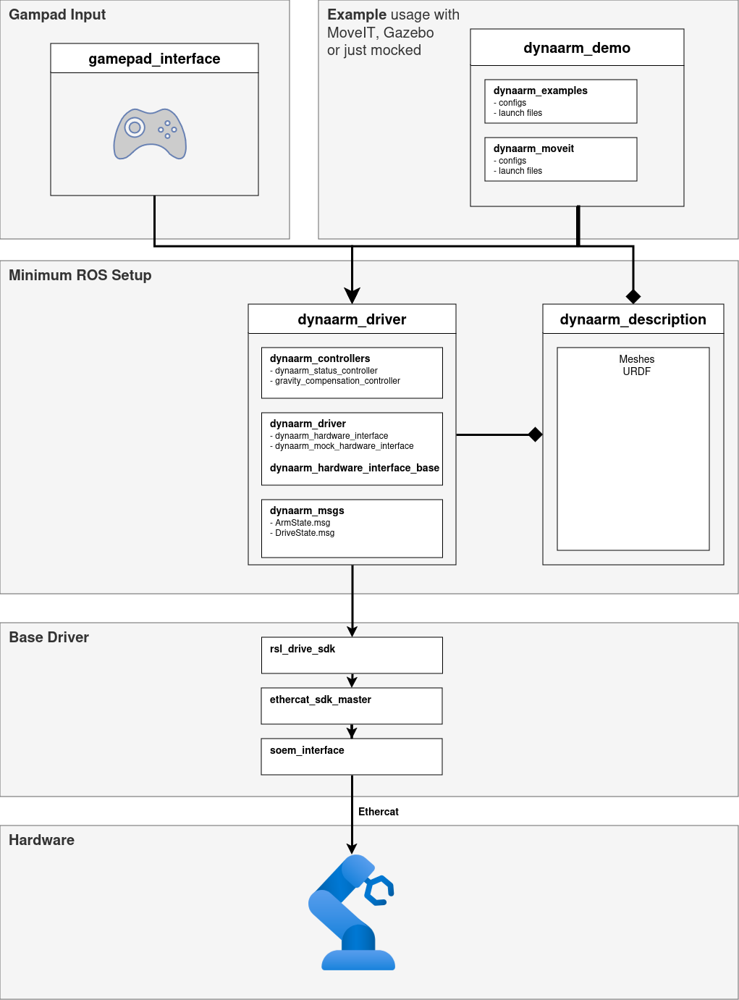

System Overview
===============

The DynaArm system is designed with a modular and scalable architecture, allowing seamless integration into diverse applications. This section provides a high-level overview of its hardware, electronics, and software.

Hardware
--------

The DynaArm relies on lightweight yet robust components optimized for high precision and flexibility. Key features include:

- **Robotic Arm:** Made from lightweight materials with 6 degrees of freedom (DoF) for precise motion.
- **Direct Drive Actuators:** High-torque motors eliminate gearboxes, ensuring smooth operation and backdrivability.
- **ISO Standard End Effector:** Compatible with ISO 9409-1-50-4-M6 flange for tool integration.

Key physical connections:

- **Power Supply:** Requires an external 48 V power source.
- **Ethercat Interface:** Primary communication protocol with the controller.
- **USB-C Interface:** Provides auxiliary connectivity for peripherals like cameras.

Electronics
-----------

The system includes:

- **Motors:** High-torque direct drive motors.
- **Sensors:** Integrated encoders for position tracking and torque measurement.
- **Controller Unit:** Manages real-time operation and communication with the Ethercat master.

Software
--------

The DynaArm software is built on a modular ROS 2-based architecture, leveraging the following packages:

.. list-table:: Packages
   :widths: 25 75 
   :header-rows: 1

   * - Package
     - Description
   * - `dynaarm_description <https://github.com/Duatic/dynaarm_description>`_
     - Description package containing URDF and meshes for the DynaArm
   * - `dynaarm_driver <https://github.com/Duatic/dynaarm_driver>`_
     - ros2_control based driver for the DynaArm.
   * - `dynaarm_demo <https://github.com/Duatic/dynaarm_demo>`_
     - Demo applications for the DynaArm. Usually used for testing a new hardware setup.
   * - `rsl_drive_sdk <https://github.com/leggedrobotics/rsl_drive_sdk>`_
     - Underlying SDK for directly controlling the drives. Can be used to control the arm without ROS

The software architecture is illustrated below:

Risk Assessment
---------------

**Important Note:** As a prototype, the DynaArm has not undergone full risk evaluation. Users are advised to:

- Operate on a stable surface and maintain a safe distance.
- Regularly inspect connections and ensure reliability.
- Use an emergency stop button for immediate shutdown in case of unexpected behavior.
