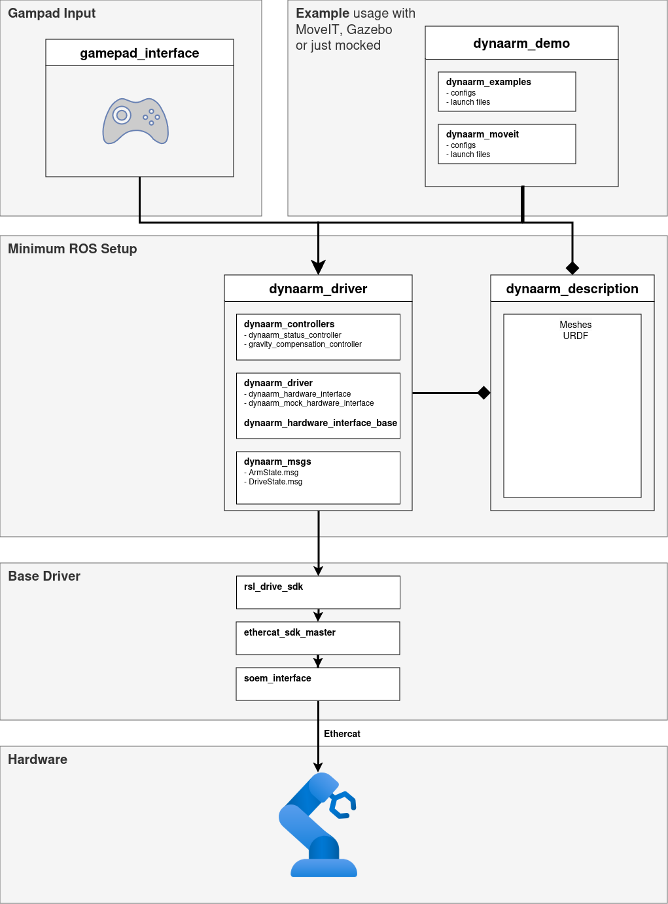

DynaArm Software Documentation
##############################

| This is the official documentation for the Duatic `DynaArm <https://duatic.com/robotic-arm/>`_
| For the hardware documentation please visit `<doc.duatic.com>`_.

.. image:: _static/dynaarm.webp
    :width: 400

Getting started
***************

Take a look at the :doc:`Getting Started </doc/getting_started>` guide

Structure
**********

The structure of the software stack is shown in the following image:

.. list-table:: Packages
   :widths: 25 75 
   :header-rows: 1

   * - Package
     - Description
   * - `dynaarm_description <https://github.com/Duatic/dynaarm_description>`_
     - Description package containing URDF and meshes for the DynaArm
   * - `dynaarm_driver <https://github.com/Duatic/dynaarm_driver>`_
     - ros2_control based driver for the DynaArm.
   * - `dynaarm_demo <https://github.com/Duatic/dynaarm_demo>`_
     - Demo applications for the DynaArm. Usually used for testing a new hardware setup.
   * - `rsl_drive_sdk <https://github.com/leggedrobotics/rsl_drive_sdk>`_
     - Underlying SDK for directly controlling the drives. Can be used to control the arm without ROS

.. toctree::
   :hidden:
   :caption: Contents:
   
   doc/getting_started
   

