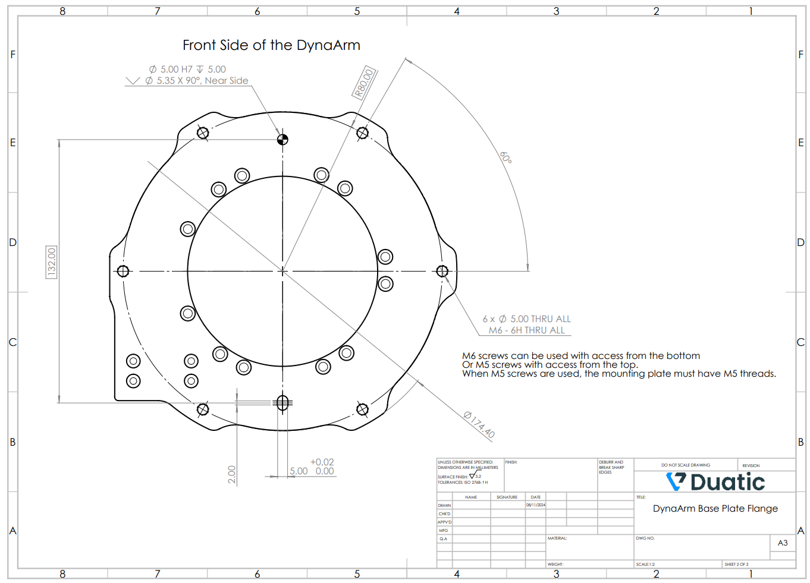

Integration and Safety
#######################

This section provides guidelines for integrating the DynaArm into your setup and ensuring safe operation. Proper integration and adherence to safety measures are critical for optimal performance and to minimize risks.

Mounting Instructions
---------------------

1. **Choose a Stable Base:**

   - Select a surface that can securely support the weight of the robot (9 kg) and any additional payload.
   - The base should be level and free of vibrations.

2. **Secure the Robot:**

   - Use the mounting holes on the robot’s base plate.
   - Follow the dimensions provided in the technical drawing below for proper alignment.

The technical drawing shows the locations and dimensions of the mounting holes for secure attachment.

3. **Verify Stability:**

   - Ensure the robot does not wobble or shift during operation.
   - Tighten all screws and bolts securely.

Wiring and Connections
----------------------

1. **Power Connection:**

   - Use a 48 V power supply that meets the specifications listed in the **Technical Specifications** section.
   - Ensure the power supply is properly grounded.

2. **Ethercat Connection:**

   - Connect the Ethercat cable to the robot and the Controller PC.
   - Verify that the network interface is configured correctly:
     .. code-block:: bash

        sudo ip link set eth0 up
        sudo ip addr add 192.168.1.2/24 dev eth0

3. **Cable Management:**

   - Route cables away from moving parts to avoid entanglement.
   - Use cable ties or channels to secure cables.

Safety Guidelines
-----------------

1. **Emergency Stop:**

   - Always ensure the emergency stop button is easily accessible during operation.
   - Test the emergency stop functionality before every session.

2. **Safe Work Area:**

   - Maintain a clear workspace around the robot.
   - Avoid placing objects within the robot’s operational range.

3. **Start-Up Precautions:**

   - Be aware that the robot may move slightly during activation.
   - Never stand within the robot’s range during start-up or shutdown.

4. **Routine Inspections:**

   - Check for loose screws, damaged cables, or other potential hazards before each use.
   - Inspect the mounting base periodically to ensure stability.

5. **Warning Signs:**

   - Place visible warning signs near the robot to alert operators and bystanders of potential risks.

.. warning::
   Failure to follow these guidelines may result in equipment damage or personal injury.
