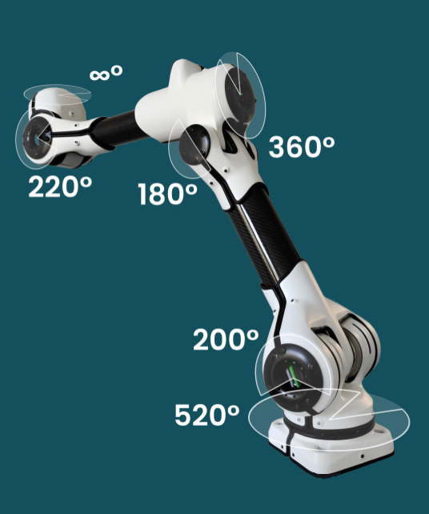

Technical Specifications
#########################

This section provides a detailed overview of the technical specifications of the DynaArm. The specifications are designed to help users understand the capabilities and limitations of the system.

Specifications Table
--------------------

+--------------------------+-------------------+
| **Specification**        | **Value**         |
+==========================+===================+
| Maximum Payload [1]_ 10s | 22 kg             |
+--------------------------+-------------------+
| Continuous Payload [1]_  | 12 kg             |
+--------------------------+-------------------+
| Reach                    | 0.990 m           |
+--------------------------+-------------------+
| Total Weight [2]_        | 9.2 kg            |
+--------------------------+-------------------+
| End Effector Speed       | 10 m/s            |
+--------------------------+-------------------+
| Joint Position Accuracy  | ± 25 μrad         |
+--------------------------+-------------------+
| Degrees of Freedom       | 6                 |
+--------------------------+-------------------+
| Input Voltage            | 48 V (DC)         |
+--------------------------+-------------------+
| Protection Rating        | IP66              |
+--------------------------+-------------------+
| Joint Torque Accuracy    | ± 0.5 Nm          |
+--------------------------+-------------------+
| Communication Interface  | Ethercat          |
+--------------------------+-------------------+
| Communication Frequency  | 1000 Hz           |
+--------------------------+-------------------+

.. [1] at maximum rachability
.. [2] without covers

Range of motion
---------------

Additional Notes
----------------

1. **Payload:**
   - Maximum payload refers to the peak capacity the arm can lift momentarily.
   - Continuous payload is the recommended capacity for sustained operations.

2. **Repeatability:**
   - The robot can consistently return to the same position with an accuracy of less than 1 mm, making it ideal for precision tasks.

3. **End Effector Compatibility:**
   - The DynaArm is compatible with ISO 9409-1-50-4-M6 standard flanges, allowing easy integration of custom tools or grippers.

4. **Protection Rating (IP66):**
   - The robot is protected against dust and powerful water jets, ensuring reliability in industrial environments.

.. note::
   Some specifications, such as power consumption, are currently under evaluation and will be updated in future revisions.
